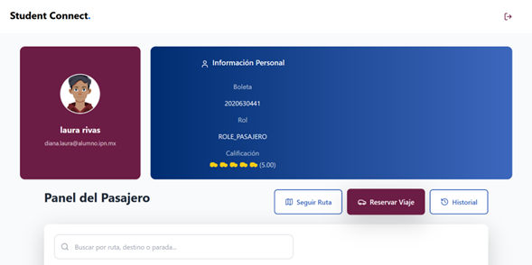
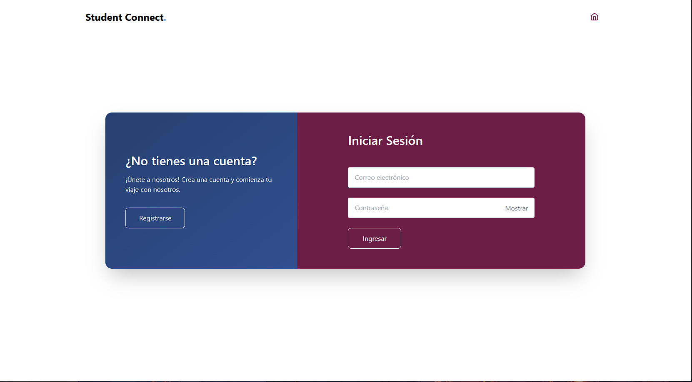
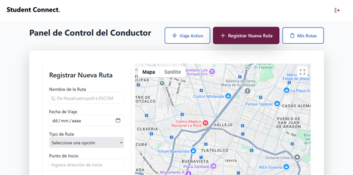
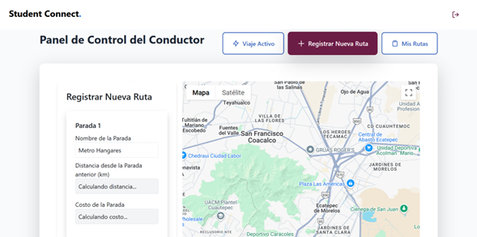
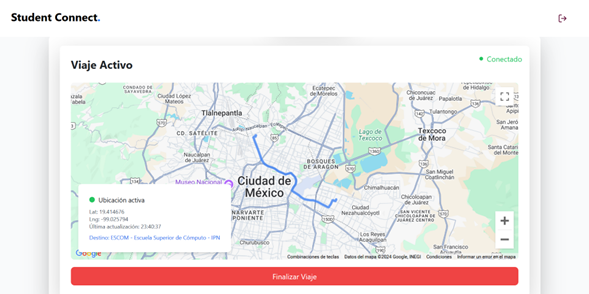

# Student Connect

## 📱 Sobre el Proyecto
Student Connect es una plataforma de transporte compartido desarrollada como Trabajo Terminal para la Escuela Superior de Cómputo (ESCOM) del Instituto Politécnico Nacional. El proyecto conecta de manera segura a estudiantes conductores y pasajeros, implementando geolocalización en tiempo real y un sistema de pagos proporcionales.

Derechos Reservados © 2024 Instituto Politécnico Nacional

## ⏱️ Duración del Proyecto
Desarrollo realizado durante el período 2023-2024 como parte del Trabajo Terminal 2024-B097.

## 🚀 Características Principales
- Autenticación segura mediante correo institucional del IPN
- Sistema de geolocalización en tiempo real para seguimiento de rutas
- Algoritmo inteligente de cálculo de costos por parada
- Sistema de calificaciones y retroalimentación
- Interfaz responsiva adaptable a cualquier dispositivo
- Gestión de rutas y paradas automatizada
- Sistema de reservaciones en tiempo real

## 🛠 Stack Tecnológico

### Frontend
- React + Vite
- TailwindCSS
- Google Maps API
- API Rest

### Backend
- Spring Boot
- MySQL

### Cloud & Deployment
- Azure Blob Storage
- Azure SQL Database
- Azure Web App
- Vercel
- GitHub Actions

## 🏗️ Arquitectura
- Implementación de API REST
- Autenticación mediante JWT
- Sistema de microservicios
- Arquitectura basada en la nube
- CI/CD mediante GitHub Actions

## 📸 Capturas de Pantalla

## 👥 Equipo de Desarrollo
- Diana Laura Rivas Carrera - Frontend Developer | UI/UX
- Alan Javier Gomez Hernandez - Full Stack Developer | DevOps

## 📄 Licencia
Este proyecto fue desarrollado como Trabajo Terminal para el Instituto Politécnico Nacional - Escuela Superior de Cómputo. 
Todos los derechos reservados © 2024 IPN.

## 🎓 Institución
Instituto Politécnico Nacional
Escuela Superior de Cómputo
Trabajo Terminal 2024-B097